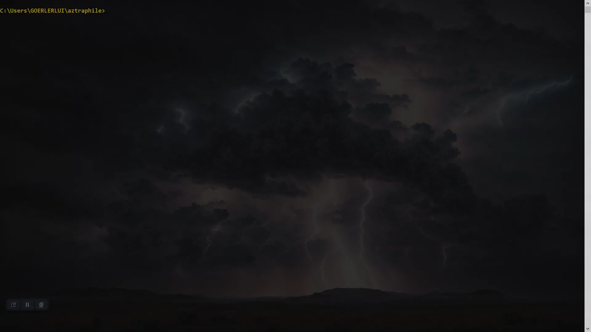

# aztraphile


## Introduction
aztraphile 🌩️ is an automation tool intended to help you accelerate the process of rolling out new Python Azure Functions 🚀 as well as ensuring you are adequately equipped to keep those Functions running smoothly. Overall, it entails:
- automated resource provisioning 🏗️ in Azure
- pre-written code 📦 (and unittest 🔬) samples using the brand new V2 programming model for Python Azure Functions
- automated setup of Azure DevOps constructs that assure quality 📋 while conducting continuous deployment ⚙️
- flexible monitoring 💡 and alerting 🚨 setup capabilities designed to fit your needs

## Feature summary/showcase
### Automated provisioning in Azure
the following resources are created by the main script:
- Storage Account
  - required to host the App
  - can hold Storage Containers for the Function App to read from and write to (Blob) files
- App Service Plan
  - consists of the underlying VM's that host the App
  - makes up the majority of the costs of running the App
- Function App
  - this is where your code gets executed
  - contains your application settings (environment variables)
  - contains a test slot that's configured to be an environment nearly identical to PROD
    - it is also a target for automatic deployments (in particular: deployments resulting from the build validation policy that get's triggered on the creation of new PRs)
- Application Insights
- Key Vault (only created if ```createKeyVault``` is set to ```true``` in the config file)
  - can securely store confidential data (such as API credentials) in the form of secrets
  - a secret with name "ExampleSecret" is created by default, you can use it for experimentation purposes
- Action Group (only gets created if there is at least one E-Mail address in the config file under ```alertRecipientMailAddresses```, otherwise NO alerts are created)
  - handles the sending of E-Mail alerts specified in the [monitoring section below](#monitoring-and-alerting)
  - having automated E-Mail alerts in place means you don't have to proactively check the status of your Functions


### Function samples and corresponding unittests
the project ships with these pre-written Function samples so you don't have to write all the boilerplate yourself:
- [HTTP Function that replies with a message depending on the passed parameters](./function-samples/http_default_function_sample.py)
- [HTTP Function that reads a secret from the keyvault](./function-samples/http_keyvault_function_sample.py) (so you have code you can reference showing how to properly store credentials your code needs to access)
- [Timer triggered Function](./function-samples/timer_function_sample.py)
- [HTTP Function that copies a Blob file](./function-samples/http_blob_replicating_function_sample.py)
- [Timer triggered Function that logs to a Blob file](./function-samples/timer_blob_logging_functions_sample.py) (and another Function that periodically clears that file)
- there are unittest samples for all of these Functions (written using pytest)
  - since you inherit a functioning assortment of tests that are properly integrated into your deployment process from the start, the usual entry barrier of having to setup a test-suite from scratch is avoided
  - this way, you can make it a habit to using automated testing for your Azure Functions from the start instead of putting it off and accruing tech debt over time

### Setup of Azure DevOps constructs
the following is a description of the setup in Azure DevOps:
- Service Connection (needed to connect to Azure from the Azure Devops pipeline when conducting the automatic deployments)
- git repository to hold your code/the sample functions
- pipeline defined by an ```azure-pipelines.yml``` file which carries out the testing and deployment process
    - automatically deploys the latest commit on the main branch to Azure
    - variables for that pipeline that allow you to parameterize certain aspects relating to your code in Azure, e.g. configuring a CRON schedule for a timer triggered Function in your test slot that differs from the one used productively (to avoid load interference)
    - when deploying your code, the pipeline also configures the appsettings of your Function App according to ```appsettings.json``` (which is tracked by git)
      - this way, changes to environment variables are also subject to peer review and can be traced retroactively
      - just make sure to never directly store credentials in the mentioned JSON file; instead, store them as a secret in the Key Vault as shown in the corresponding function samples (you do need a Key Vault reference in the appsettings file though, as shown here)
    - the pipeline also integrates with the builtin Azure Devops test reporting feature
    
    
- repository policy ensuring PRs targeting main can't get merged unless they have at least 2 approvers
- build policy that ensures pending changes get deployed to the test slot once a PR is created
  - PRs that cause failing tests are blocked from merging until all unittests are passed
  - this policy, together with the test slot mentioned [above](#automated-provisioning-in-azure) (which is used as a deployment target instead of PROD when the pipeline runs for changes proposed in a PR) enables you to verify new versions of your code in a safe, isolated environment, even if you haven't bothered to keep your code covered with unittests

#### Example anatomy showing deployment, hosting and runtime interactions of Azure Function code in different lifecycle stages


### Monitoring and alerting
- this project contains code that can plot graphs in the console; calls [Show-Graph](https://gist.github.com/PrateekKumarSingh/9168afa8e7c7da801efa858705fb485b) under the hood
  - graphical monitoring is available via ```Show-FaMetric``` which can display CPU and memory workload
  - displaying key metrics over configurable spans of times like that can help you recognize patterns at first glance you might have missed otherwise
  
- by default (if the condition described in the provisioning section [above](#automated-provisioning-in-azure) is met in the config file), you will receive E-Mail alerts pertaining to your function
  - there is a metric alert rule that triggers if the average CPU percentage is over 90
  - there is a metric alert rule that triggers if the maximum memory usage percentage is over 90
  - additionally, a log search alert rule is created that activates if any exceptions occurred in the execution of your Functions during the last hour
- instead of using such builtin push-based constructs, you could easily opt for a polling-based approach by running queries periodically using ```Fetch-FaMetric``` and ```Fetch-FaInsights``` (a simple example of applying keyword message filtering to the results of ```Fetch-FaInsights``` is shown in the ("Advanced usage" section)[#advanced-usage], you can go explore the code or run the Get-Help commandlet on the mentioned utility functions for in-depth documentation)

### Additional orchestration features
there are lots of orchestration/utility features in the form of powershell functions stored in ```aztra-utils.ps1```. You can run them locally, so you don't have to bother with the Azure portal
- ```Set-KvSecret``` let's you create secrets
- ```Create-StorageContainer``` can create Storage Containers for you
- ```Restart-FunctionAppCompletely``` performs a full restart on a Function App; you can also stop it prematurely to keep the App shut off (charges still apply)
- ```Invoke-Function``` let's you call a Function via it's HTTP API

- ```Set-AzPipelinesVar``` is used to create/update Azure DevOps build variables

## Advanced usage
- you can try to be extra smart about your testing strategy and achieve a level of efficiency that's usually only achievable with proper suites of unittests even without covering your code and maintaining those tests
  - (you could also use this strategy complementary to your unittests, I definitely don't discourage having them anyway!)
  - the way to achieve that kind of efficiency through integration/system-level testing in this context is via leveraging the automatic deployments that trigger on PR creation as follows:
    - let's say you have an important service that is the main consumer of the API of your Function
    - but you also have a dashboard internal to your team that's used to guide/support some day-to-day manual activity
      - or maybe just another, less critical service
      - or even a legacy service you're in the process of phasing out anyway
    - configure that non-critical service/dashboard to use the URL pointing to the test slot
      - this way, you can observe the results of new versions being "tested automatically" with limited potential for major repercussions before deciding whether to merge new changes or not
    - another situation where you can leverage your test slot would be if you're in a situation where there's another team that's pushing for new features you are responsible for, which they might need for a new service they're currently getting off the ground
      - you could offer to hook them up to the test slot for fast access to new features under the caveat that it might not be completely stable
    - thus, the less vital consumers can act as an additional layer of validation in terms of testing
- filtering logs based on their message ```Fetch-FaInsights -InsightsSpecifier "logs" -Raw | Where-Object (Build-LogMessageSieve "executed")```
- polling of logs (live, without duplicated events) and optional filtering based on a passed query (coming soon)
- live metric plotting in a console window (coming soon)
